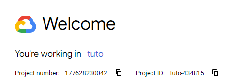

# TrustiSend

## Description

**TrustiSend** (trʌst aɪ sɛnd) est une plateforme de transfert de fichiers sécurisée qui intègre une analyse anti-malware avant l'envoi des fichiers. L'application est conçue pour garantir la sécurité des données grâce à un chiffrement de bout en bout et une authentification à deux facteurs (2FA).

## Fonctionnalités

- **Transfert sécurisé de fichiers** : Upload et téléchargement de fichiers avec chiffrement.
- **Analyse de malware** : Scanne les fichiers au préalable pour détecter et éliminer les menaces potentielles.
- **Authentification 2FA** : Authentification à deux facteurs pour sécuriser l'accès utilisateur.
- **Interface utilisateur intuitive** : Design simple et réactif pour une expérience utilisateur optimale.

## Technologies Utilisées

- **Backend** : [Java Spring Boot](https://spring.io/projects/spring-boot) - Framework robuste pour le développement web en Java.
- **Frontend** : [Thymeleaf](https://www.thymeleaf.org/) - Moteur de template intégré avec Spring Boot pour des vues dynamiques rendues côté serveur.
- **Base de données** : [Google Cloud Datastore](https://cloud.google.com/datastore) - Solution flexible et performante pour le stockage des données.
- **Infrastructure** : [Google App Engine](https://cloud.google.com/appengine) - Plateforme de déploiement offrant scalabilité automatique et haute disponibilité.
- **CI/CD** : [Google Cloud Build](https://cloud.google.com/build) - Pipeline d'intégration et de déploiement continu automatisé.
- **Sécurité et Gestion des Accès** : [Spring Security](https://spring.io/projects/spring-security) - Intégration dans Spring Boot de gestion d'accès et d'authentification
- **Gestion des fichiers** : Intégration avec [Google Cloud Storage](https://cloud.google.com/storage) pour un stockage sécurisé et scalable.
- **Analyse de Malware** : [VirusTotal API](https://www.virustotal.com/) pour l'analyse des fichiers avant partage.

## Structure du Projet

- `/app` : Contient le code source du projet.
- `/dev` : Contient les codes temporaires de test en amont du déploiement.
- `/docs` : Documentation du projet, incluant les schémas d'architecture, les cdc et les mockups.
- `/resources` : Contient les fichiers de configuration et les ressources statiques.
- `/tests` : Contient les tests unitaires et d'intégration pour assurer la qualité du code.


## Installation et Configuration

### Prerequisites 

Docker

### Configuration Cloud pour run en local le projet spring boot

#### Creation d'un compte et projet sur Cloud Console
[link to Cloud Console](https://console.cloud.google.com/welcome?)

1. Créer un nouveau projet
2. Selectionne le nouveau projet
   
#### Configuration Firestore 

1. Rechercher Firestore dans la console google
2. Créer une base de données
3. Dans Configure your database
   1. Database ID -> trustisend ( name of choice )
   2. Location type -> Region -> europe-west-1
   3. Laisser le reste par défaut
4. Create Database


#### Configuration Cloud Storage

1. Rechercher Cloud Storage dans la console google
2. Create Bucket
3. Bucket name -> storage-trustisend (name of choice again)
4. Choose where to store your data
   1. Region -> europe-west-1
5. Leave the rest by default
6. Create Bucket
7. Public access will be prevented -> Enforce public access prevention on this bucket

#### Credentials

1. Rechercher Credentials dans la console google
2. Create credentials
3. Service Account
4. Service account name -> storage
5. Create and continue
6. Add Role ->  Storage Admin
7. Done
8. Create credentials
9. Service Account 
10. Service account name -> firestore
11. Create and continue
12. Add Role -> Firestore Service Agent
13. Done

 Sur la page de Credentials normalement il y a les Service accounts qui sont présent. Sur les deux comptes, il faut créer et télécharger les clefs.

15. Cliquer sur le compte
16. Keys
17. Add Key
18. Create new key
19. Json -> Create

(PS : If you lose the page, you can go to IAM Roles to grand access to roles to the Serice account that was just created. )

#### Get Project ID

Go to the main welcome page, select at the top of screen the project. 



#### Cloner ou fork le dépôt 

#### Configuration variables d'environnement

We have set the keys in the resources folder, but it didn't change much since we used the absolute path. We couldn't find the execution path for a relative path.

```bash
/app/src/main/resources/application.properties
```

```yaml

spring.application.name=trustisend

project.id= # set project ID 
firebase.credentials.path= # set path to credentials
firebase.database.id= # set database name

gcp.credentials.path= # set path to credentials
gcp.bucket.id= # set bucket name

# don't need to touch anything
logging.level.org.springframework.security=TRACE
spring.servlet.multipart.max-file-size=100MB
spring.servlet.multipart.max-request-size=5GB
server.tomcat.connection-timeout=60000
server.tomcat.max-swallow-size=5GB
server.tomcat.max-http-form-post-size=5GB
spring.servlet.multipart.enabled=false 
logging.level.org.springframework.web.multipart=DEBUG
spring.resources.enabled=true

```

### Configuration Cloud pour run en local le projet spring boot


## Contribuer


## Auteurs

- **Équipe TrustiSend** - Initialement créé par Amir Mouti, Nathan Rayburn, Felix Breval et Ouweis Harun

## Licence

## NB
Le README évoluera en fonction du projet!
