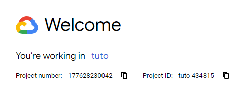

# TrustiSend

## Description

**TrustiSend** (trʌst aɪ sɛnd) est une plateforme de transfert de fichiers sécurisée qui intègre une analyse anti-malware avant l'envoi des fichiers. L'application garantit la sécurité des données grâce à un chiffrement de bout en bout et à une authentification à deux facteurs (2FA).

## Fonctionnalités

- **Transfert sécurisé de fichiers** : Upload et téléchargement de fichiers avec chiffrement.
- **Analyse de malware** : Scan des fichiers pour détecter et éliminer les menaces potentielles.
- **Authentification 2FA** : Authentification à deux facteurs pour renforcer la sécurité utilisateur.
- **Interface utilisateur intuitive** : Design simple et réactif pour une expérience utilisateur optimale.

## Technologies Utilisées

- **Backend** : [Java Spring Boot](https://spring.io/projects/spring-boot) - Framework robuste pour le développement web en Java.
- **Frontend** : [Thymeleaf](https://www.thymeleaf.org/) - Moteur de template intégré à Spring Boot pour des vues dynamiques.
- **Base de données** : [Google Cloud Datastore](https://cloud.google.com/datastore) - Solution performante pour le stockage des données.
- **Infrastructure** : [Google App Engine](https://cloud.google.com/appengine) - Plateforme de déploiement offrant scalabilité et haute disponibilité.
- **CI/CD** : [Google Cloud Build](https://cloud.google.com/build) - Pipeline d'intégration et de déploiement continu.
- **Sécurité** : [Spring Security](https://spring.io/projects/spring-security) - Gestion d'accès et d'authentification intégrée dans Spring Boot.
- **Gestion des fichiers** : [Google Cloud Storage](https://cloud.google.com/storage) pour un stockage sécurisé.
- **Analyse de Malware** : [VirusTotal API](https://www.virustotal.com/) pour l'analyse des fichiers avant leur partage.

## Structure du Projet

- `/app` : Code source principal du projet.
- `/dev` : Codes temporaires pour les tests avant déploiement.
- `/docs` : Documentation du projet, incluant schémas d'architecture, cdc, et mockups.
- `/resources` : Fichiers de configuration et ressources statiques.
- `/tests` : Tests unitaires et d'intégration pour garantir la qualité du code.
- `/projects` : Contient les projets sur les trois branches : av, scheduler et main. Rassembler pour exécuter en local.
  
[Visitez notre site web](https://dev-579596661856.europe-west1.run.app/)

## Installation et Configuration

### Prérequis

- **Docker**

### Configuration Cloud pour exécuter le projet Spring Boot en local

#### Création d'un compte et projet sur Google Cloud Console

1. Accéder à [Google Cloud Console](https://console.cloud.google.com/welcome?).
2. Créer un nouveau projet.
3. Sélectionner le nouveau projet.

#### Configuration Firestore

1. Rechercher Firestore dans Google Cloud Console.
2. Créer une base de données.
3. Dans "Configure your database" :
   - **Database ID** : `trustisend` (nom au choix)
   - **Location type** : Région -> `europe-west-1`
   - Laisser le reste par défaut.
4. Créer la base de données.

#### Configuration Cloud Storage

1. Rechercher Cloud Storage dans Google Cloud Console.
2. Créer un Bucket.
   - **Bucket name** : `storage-trustisend` (nom au choix).
3. Choisir l'emplacement des données : Région -> `europe-west-1`.
4. Laisser le reste par défaut.
5. Créer le Bucket.
6. Interdire l'accès public : "Enforce public access prevention on this bucket".

#### Création des Credentials

1. Rechercher "Credentials" dans Google Cloud Console.
2. Créer des credentials :
   - **Service Account Name** : `trustisend`.
   - Ajouter le rôle : **Storage Admin**.
   - Ajouter le rôle : **Firestore Service Agent**.
3. Télécharger les clés pour le Service Account :
   - Aller dans "Keys" du Service Account.
   - Ajouter une clé JSON et la télécharger.

> **Note** : Dans la page des credentials, un e-mail avec le nom du compte devrait s'afficher. Cliquez dessus pour accéder au compte.

#### Récupérer Google Cloud Project ID

1. Accéder à la page d'accueil principale.
2. Sélectionner le projet en haut de l'écran.



### Cloner ou fork le dépôt

SSH 
```bash
git clone git@github.com:nathanrayburn/trustisend.git
```

HTTPS
```bash
git clone https://github.com/nathanrayburn/trustisend.git
```

### Configuration des variables d'environnement du projet Spring Boot

L'arbre des projets se situe dans `/projects`.

```bash
Projects
├── av
│   ├── app
│   └── Dockerfile
├── schedule
│   ├── app
│   └── Dockerfile
└── spring-boot
   ├── app
   └── keys
```

Il faut glisser la clé dans `/keys` pour le projet :

```bash
/spring-boot/keys/your-credential-key.json
```
Il faut mettre à jour le fichier de configuration de variables d'environnements Spring Boot correspondant à l'infrastructure cloud.

```bash
/spring-boot/app/src/main/resources/application.properties
```

```yaml
spring.application.name=trustisend
project.id= # set Google Cloud Project ID
gcp.bucket.id= # set the name of the bucket we created
firebase.database.id= # set the name of the Firestore database

# Nothing to do here
logging.level.org.springframework.security=TRACE
spring.servlet.multipart.max-file-size=100MB
spring.servlet.multipart.max-request-size=5GB
server.tomcat.connection-timeout=60000
server.tomcat.max-swallow-size=5GB
server.tomcat.max-http-form-post-size=5GB
spring.servlet.multipart.enabled=false 
logging.level.org.springframework.web.multipart=DEBUG
spring.resources.enabled=true
```
Pour run le container local, on doit copier le dossier `/keys` dans le container.

```bash
/spring-boot/Dockerfile
```

```Dockerfile
FROM maven:3.9.4-eclipse-temurin-21 AS build

WORKDIR /app

COPY ./app/pom.xml ./pom.xml
COPY ./app/src ./src

RUN mvn clean package -DskipTests

FROM eclipse-temurin:21-jre-alpine

WORKDIR /app

COPY --from=build /app/target/*.jar ./app.jar

COPY ./keys ./keys # uncomment this line if commented

EXPOSE 8080

ENTRYPOINT ["java", \
  "-XX:+UseContainerSupport", \
  "-XX:MaxRAMPercentage=75.0", \
  "-XshowSettings:vm", \
  "-XX:+ExitOnOutOfMemoryError", \
  "-Djava.security.egd=file:/dev/./urandom", \
  "-jar", \
  "./app.jar"]
```

### Configuration des variables d'environnement des projets Antivirus (av) et Scheduler (schedule)

Il faut copier la clé dans `/app`.

```bash
/app/your-google-credentials.json
```

**xx** = dossiers av et schedule.

Il faut mettre à jour le fichier de configuration correspondant à l'infrastructure cloud.

```bash
/xx/app/configuration.json
```

```json
{
  "projectID": "project-id", 
  "firestore": {
    "credentials": "your-google-credentials.json",
    "databaseID": "firestore-database-name"
  },
  "storage": {
    "credentials": "your-google-credentials.json",
    "bucket": "bucket-name"
  },
  "antivirus": {
    "api-key": "virtus-total-api-key",
    "file-scan-limit": 4
  }
}
```

### Configuration de l'image Docker et Build

Si vous voulez lancer seulement l'application Spring-boot vous pouvez simplement lancer cette commande.

```bash
docker run -d \
  -p 8080:8080 \
  -e GOOGLE_APPLICATION_CREDENTIALS=/app/keys/google-credentials.json \
  your-image-tag
```
Pour lancer les trois containers : 

```bash
docker compose build
```

```bash
docker compose up
```

## Contribution

Pour contribuer au projet, merci de suivre les instructions de notre guide de contribution.

## Auteurs

- **Équipe TrustiSend** - Créé par Amir Mouti, Nathan Rayburn, Felix Breval et Ouweis Harun.