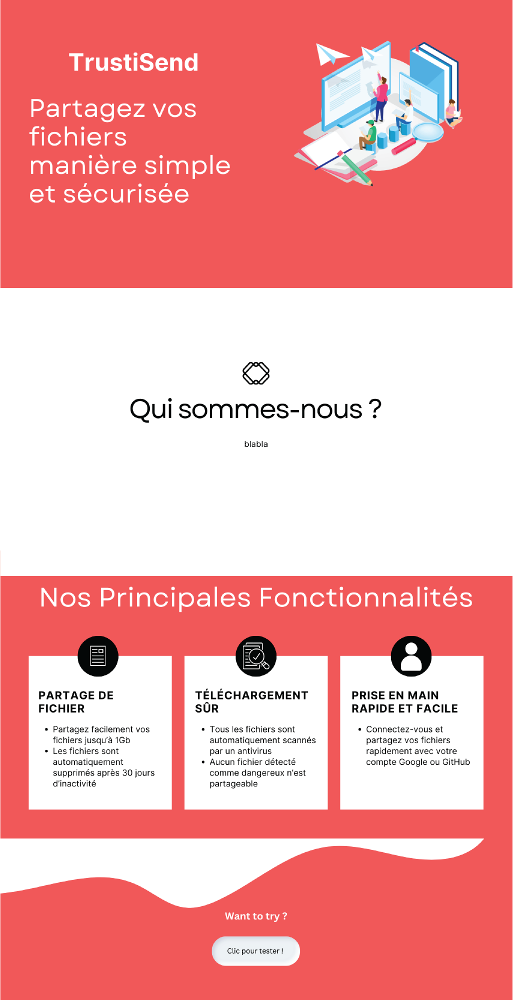
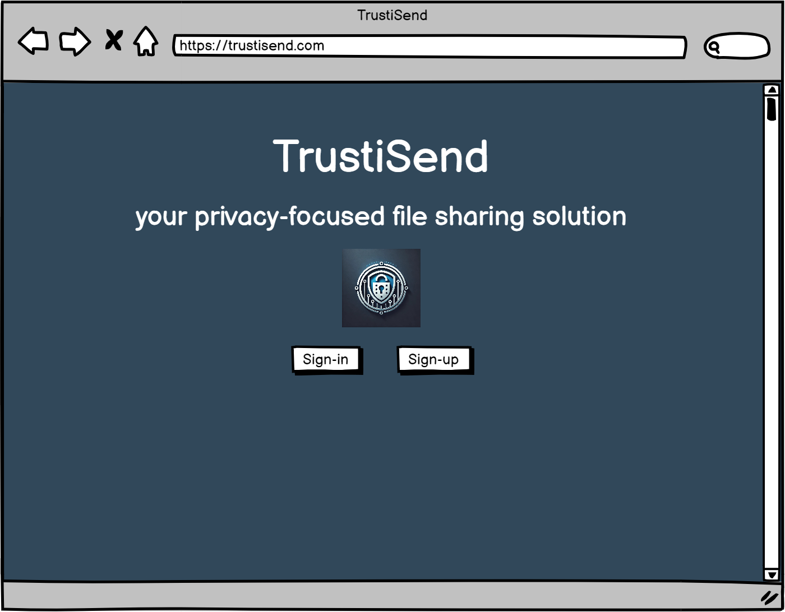
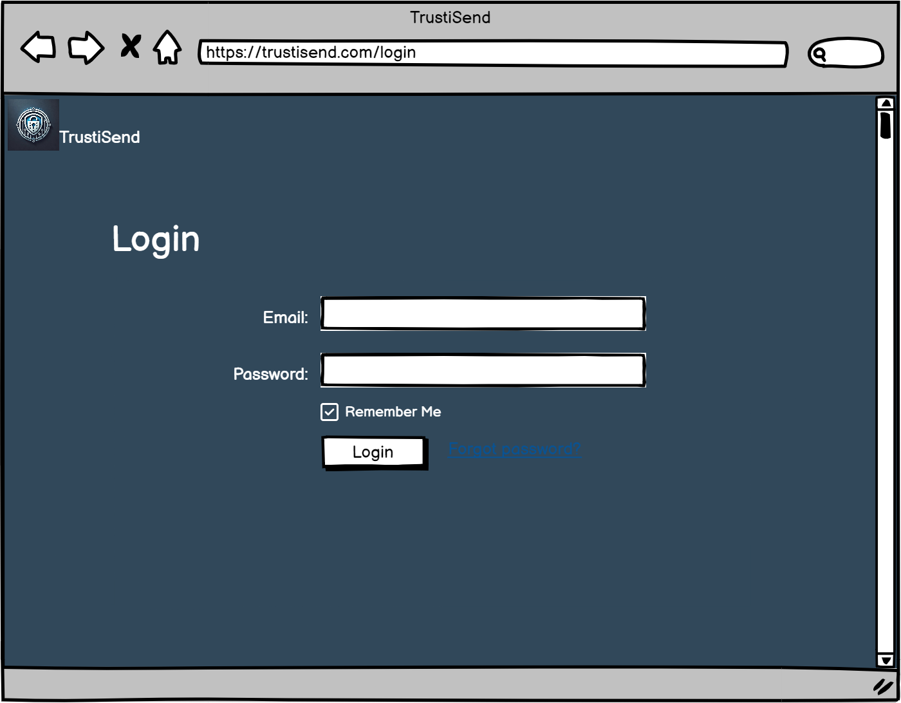
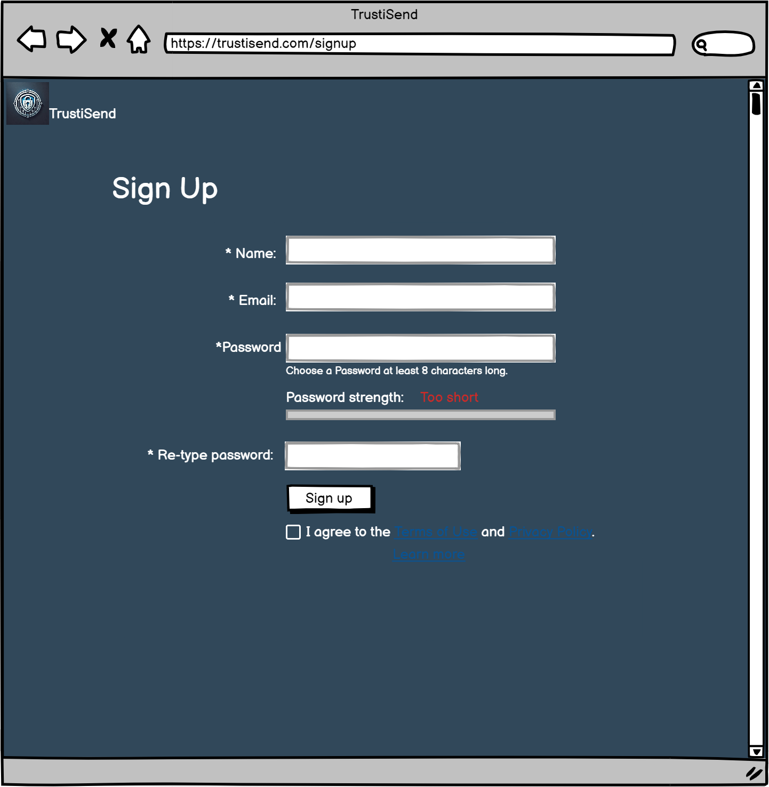
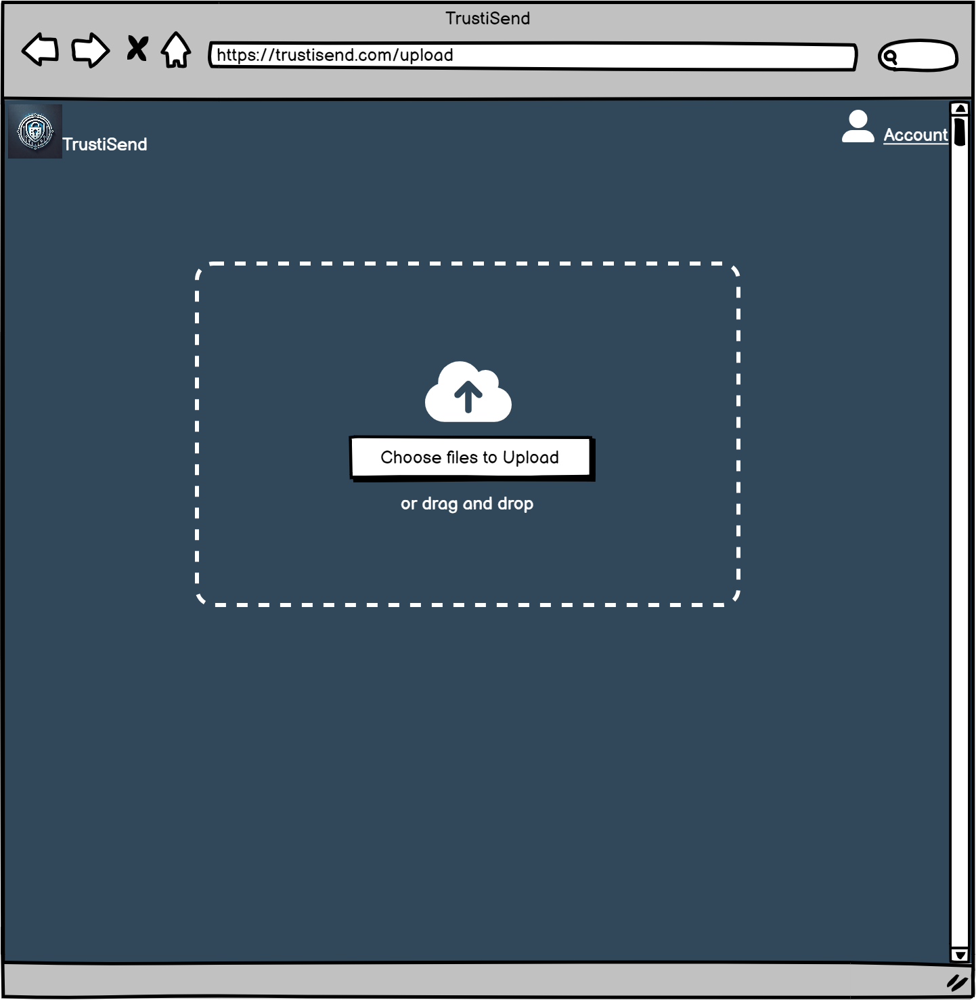
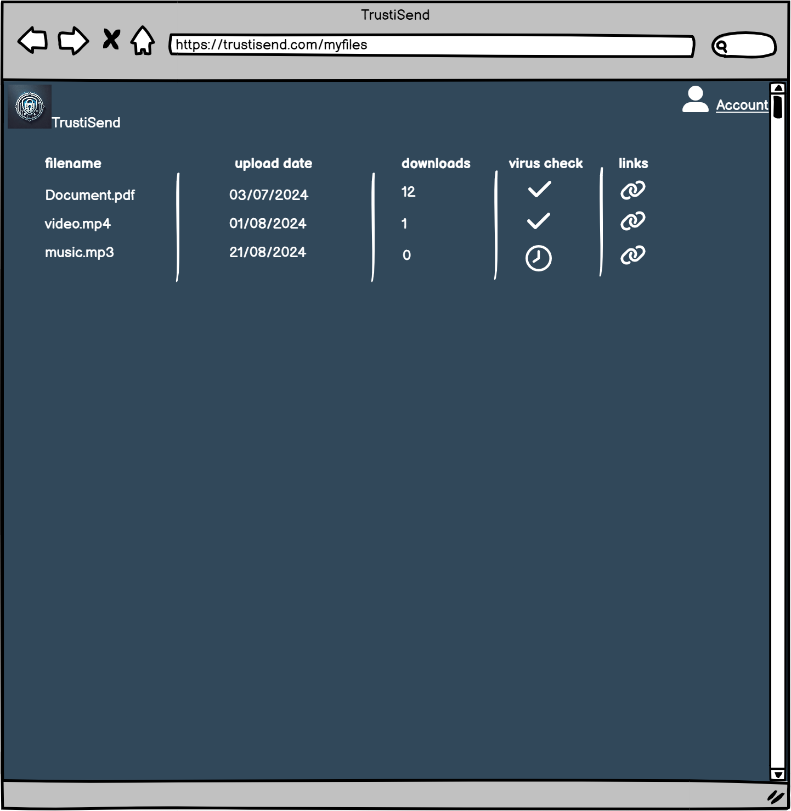
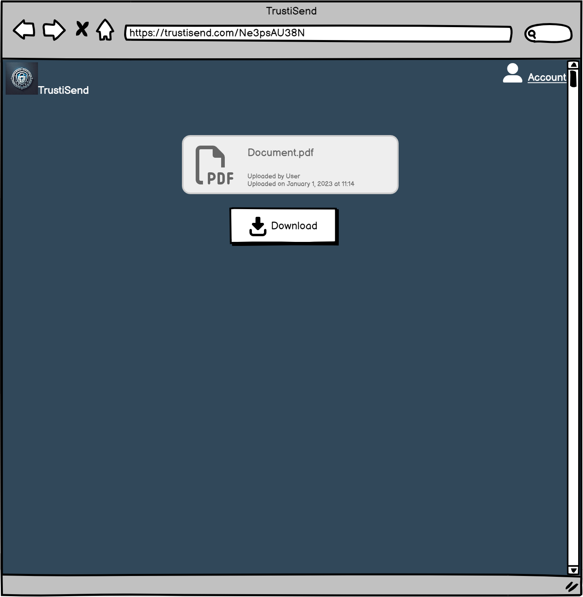

# Rapport de projet TrustiSend - Livrable 1

## **1. Description du projet**

**Objectif du projet :**
Le projet **TrustiSend** (trʌst aɪ sɛnd) vise à développer une plateforme de transfert de fichiers sécurisée qui analyse automatiquement les fichiers téléchargés pour détecter les malwares avant de les partager. L'application est conçue pour garantir la confidentialité des fichiers grâce au chiffrement de bout en bout et à une authentification à deux facteurs (2FA).

**Exigences Fonctionnelles :**

1. **Connexion** : Les utilisateurs pourront se connecter via Google, GitHub, ou en créant un compte sur le site.
2. **Téléchargement sécurisé de fichiers** : Les utilisateurs pourront télécharger des fichiers qui seront chiffrés automatiquement pour garantir leur confidentialité.
3. **Partage de fichiers** : Chaque fichier téléchargé recevra une clé unique qui permettra de le partager avec d'autres utilisateurs.
4. **Téléchargement par clé** : Les utilisateurs, y compris les invités, pourront télécharger des fichiers via la clé associée.
5. **Analyse de malware** : Les fichiers seront scannés automatiquement pour détecter et éliminer les menaces avant d'être partagés. Les fichiers considérés comme dangereux ne pourront pas être partagés.
6. **Expiration des fichiers** : Les fichiers non téléchargés pendant 30 jours seront automatiquement supprimés.

**Exigences Non-Fonctionnelles :**

1. **Interface utilisateur** : Le site doit être intuitif et facile à utiliser, même pour des utilisateurs sans connaissances techniques.
2. **Sécurité des données** : Les fichiers ne seront jamais stockés en clair sur les serveurs, seulement sous forme chiffrée.
3. **Scalabilité** : Le système doit être capable de gérer un grand nombre de fichiers et d'utilisateurs simultanément.
4. **Performance** : L'analyse des malwares doit être rapide, avec un temps de traitement de moins de 5 minutes par fichier.
5. **Limite de taille** : Le système doit pouvoir gérer des fichiers de 1 Go ou moins.
6. **Robustesse** : Le système doit être résilient face aux pannes, avec une capacité de redémarrage automatique.
7. **Protection Contre les Corruptions** : Le système doit garantir l'intégrité des fichiers même en cas de panne.
8. **Limitation des téléchargements** : Les utilisateurs seront limités à 10 téléchargements par jour.

### **2. Description préliminaire de l'architecture**

Cette section présente une vue d'ensemble de l'architecture du projet **TrustiSend** sans entrer dans les détails techniques spécifiques, lesquels seront abordés en profondeur dans la section des choix techniques.

#### **Architecture Globale**

- **Backend** :
  - L'application backend est développée en Java utilisant **Spring Boot**. Ce choix permet de créer une application web sécurisée et performante tout en simplifiant la gestion des configurations et des dépendances.
  - L'authentification et la gestion des autorisations sont assurées via des intégrations avec des solutions telles que **Casdoor** pour les identités et **Casbin** pour les permissions.
  - Les fichiers uploadés sont scannés pour les malwares via l'API **VirusTotal**.

- **Frontend** :
  - Le frontend utilise **Thymeleaf** pour générer des vues dynamiques, intégrant une séparation claire entre la logique métier et l'interface utilisateur. L'interface elle-même est construite avec HTML, CSS, et JavaScript pour assurer réactivité et accessibilité.

- **Infrastructure** :
  - L'application est hébergée sur **Google App Engine**, ce qui permet de bénéficier d'une scalabilité automatique et d'une gestion simplifiée de l'infrastructure.
  - Les fichiers des utilisateurs sont stockés dans **Google Cloud Storage** avec des configurations de sécurité robustes.
  - L'intégration continue et le déploiement continu (CI/CD) sont automatisés via **Google Cloud Build**.

### **3. Mockups**

#### **a. Page vitrine (Landing page)**

**Description :**

- **Bannière supérieure** : Affiche le nom de l'application "TrustiSend" et un message clair sur la fonctionnalité principale : "Partagez vos fichiers manière simple et sécurisée". Un bouton "En savoir plus" est également présent pour inciter les utilisateurs à explorer davantage.
  
- **Section "Qui sommes-nous?"** : Une brève présentation de l'équipe ou de l'entreprise derrière TrustiSend, avec la possibilité d'ajouter des détails supplémentaires.

- **Section d'introduction aux fonctionnalités clés** :
  - Mises en avant des principales fonctionnalités : partage de fichiers sécurisé, téléchargement sûr, et facilité de connexion via Google ou GitHub.

**Fonctionnalités :**

- Navigation claire avec un focus sur la sécurité et la simplicité.

#### **b. Page d'accueil (Front Page)**

**Description :**

- **Titre et slogan** : La page affiche le nom de l'application "TrustiSend" avec le slogan "your privacy-focused file sharing solution".
- **Logo** : Le logo de TrustiSend est placé au centre de la page.
- **Boutons de connexion et d'inscription** : Deux boutons permettent à l'utilisateur de se connecter ("Sign-in") ou de créer un compte ("Sign-up").

**Fonctionnalités :**

- **Lien vers les pages de connexion et d'inscription** : Les boutons "Sign-in" et "Sign-up" redirigent les utilisateurs vers les pages de connexion et d'inscription respectives.

#### **c. Page de connexion (Login Page)**

**Description :**

- **Formulaire de connexion** :
  - **Champs email et mot de passe** : Les utilisateurs doivent entrer leur adresse email et leur mot de passe pour accéder à leur compte.
  - **Option Remember Me** : Une case à cocher permet de rester connecté sur l'appareil utilisé.
  - **Lien "Forgot Password?"** : Un lien permet aux utilisateurs de récupérer leur mot de passe en cas d'oubli.
  - **Bouton Login** : Ce bouton valide les informations entrées et connecte l'utilisateur à son compte.

**Fonctionnalités :**

- **Connexion sécurisée** : L'utilisateur peut se connecter en toute sécurité via le backend géré par Spring Security.
- **Récupération de mot de passe** : En cliquant sur "Forgot password?", l'utilisateur peut initier un processus de récupération de mot de passe.

#### **d. Page d'inscription (Sign Up Page)**

**Description :**

- **Formulaire d'inscription** :
  - **Champs Nom, Email, Mot de Passe, et confirmation du Mot de Passe** : Les utilisateurs doivent remplir ces informations pour créer un compte.
  - **Indicateur de force du mot de passe** : Un indicateur de sécurité affiche la robustesse du mot de passe choisi.
  - **Case à cocher pour accepter les conditions générales** : L'utilisateur doit accepter les termes et conditions avant de créer un compte.
  - **Bouton Sign Up** : Valide les informations et crée le compte utilisateur.

**Fonctionnalités :**

- **Validation des champs** : Des validations sont effectuées pour vérifier que toutes les informations sont correctes avant de soumettre le formulaire.
- **Création de compte** : Le backend gère la création du compte en s'assurant que les informations sont stockées de manière sécurisée.

#### **e. Page d'upload (Upload Page)**

**Description :**

- **Zone de téléchargement** :
  - **Bouton "Choose files to Upload"** : Les utilisateurs peuvent cliquer pour sélectionner des fichiers depuis leur appareil.
  - **Fonctionnalité Drag and Drop** : Les utilisateurs peuvent aussi glisser-déposer des fichiers directement dans la zone dédiée.

**Fonctionnalités :**

- **Téléchargement sécurisé** : Les fichiers téléchargés sont immédiatement chiffrés et scannés pour détecter des malwares.
- **Interface intuitive** : La zone de téléchargement est simple et facile à utiliser, permettant de charger des fichiers rapidement.

#### **f. Page "Mes Fichiers" (My Files Page)**

**Description :**

- **Liste des fichiers** :
  - **Tableau** : Les fichiers téléchargés par l'utilisateur sont listés avec des informations comme le nom, la date de téléchargement, le nombre de téléchargements, le statut du contrôle antivirus, et un lien de partage.
  - **Colonne Virus Check** : Indique si le fichier a été scanné et approuvé pour le partage.
  - **Colonne Links** : Fournit un lien unique pour chaque fichier, que l'utilisateur peut partager avec d'autres.

**Fonctionnalités :**

- **Gestion des fichiers** : L'utilisateur peut surveiller l'état de ses fichiers et obtenir des liens de partage.
- **Contrôle de sécurité** : Assure que les fichiers partagés sont sûrs et exempts de malwares.

#### **g. Page de téléchargement (Download Page)**

**Description :**

- **Fichier à télécharger** :
  - **Information sur le fichier** : Affiche des détails comme le nom du fichier, l'utilisateur qui l'a téléchargé, et la date du téléchargement.
  - **Bouton download** : Permet de télécharger le fichier.

**Fonctionnalités :**

- **Téléchargement Sécurisé** : Les utilisateurs peuvent télécharger des fichiers en toute sécurité via le lien unique fourni.

### **4. Description des choix techniques**

Cette section fournit une explication détaillée des choix techniques effectués pour le projet TrustiSend, en s'assurant que chaque décision prise est alignée avec les exigences du projet.

#### **a. Langage et frameworks backend**

- **Java avec Spring Boot** :
  - **Pourquoi ce choix ?** : Spring Boot est largement reconnu pour sa robustesse et sa facilité de configuration, ce qui le rend idéal pour construire une application Java fiable et scalable.
  - **Caractéristiques clés** : Auto-configuration, support des microservices, facilité d'intégration avec de nombreux services et frameworks, et une communauté active pour le support.

- **Spring WebFlux** :
  - **Pourquoi ce choix ?** : Utilisé pour les besoins de programmation réactive, WebFlux permet de gérer efficacement de nombreuses requêtes simultanées sans compromettre les performances.
  - **Caractéristiques clés** : Support des APIs réactives, gestion non-bloquante des I/O, meilleure utilisation des ressources.

#### **b. Sécurité et Gestion des Accès**

- **Casdoor (Gestion des identités et des accès)** :
  - **Pourquoi ce choix ?** : Casdoor gère l'authentification et l'autorisation des utilisateurs, avec une intégration simple avec Spring Security et une interface utilisateur pour gérer les rôles et permissions.
  - **Caractéristiques clés** : Authentification SSO, support d'OAuth2 et OpenID Connect, intégration avec Casbin pour la gestion des autorisations.

- **Casbin (Gestion des permissions)** :
  - **Pourquoi ce choix ?** : Casbin permet de définir des politiques d'autorisation complexes, adaptées pour gérer les permissions granulaires au sein de TrustiSend.
  - **Caractéristiques clés** : Support des modèles ABAC, RBAC, ACL, facile à intégrer avec Spring Boot, flexibilité dans la définition des règles.

#### **c. Stockage et Gestion des Fichiers**

- **Google Cloud Storage** :
  - **Pourquoi ce choix ?** : Fournit un stockage sécurisé, scalable, et performant pour les fichiers utilisateurs. Son intégration native avec d'autres services Google Cloud simplifie la gestion et la sécurité des fichiers.
  - **Caractéristiques clés** : Chiffrement automatique, haute disponibilité, options de gestion fine des accès.

- **Intégration avec Spring Boot via WebFlux** :
  - **Pourquoi ce choix ?** : WebFlux est utilisé pour interagir de manière réactive avec Google Cloud Storage, garantissant une performance optimale même sous forte charge.
  - **Caractéristiques clés** : Gestion asynchrone des fichiers, support des flux de données, réduction des temps de latence.

#### **d. Gestion de la sécurité et des fichiers**

- **VirusTotal API (Analyse de malware)** :
  - **Pourquoi ce choix ?** : L'API VirusTotal fournit une analyse rapide et précise des fichiers contre une vaste base de données de malwares.
  - **Caractéristiques clés** : Large base de données de signatures, API RESTful facile à intégrer, scan complet des fichiers.

#### **e. Frontend et intégration**

- **Thymeleaf** :
  - **Pourquoi ce choix ?** : Facilite la création de vues dynamiques en s'intégrant parfaitement avec Spring Boot, tout en permettant une séparation claire entre la logique métier et la présentation.
  - **Caractéristiques clés** : Syntaxe puissante, intégration avec Spring Security, support pour les templates réactifs.

- **HTML, CSS, JavaScript** :
  - **Pourquoi ce choix ?** : Ces technologies de base sont utilisées pour structurer, styliser, et dynamiser les pages de TrustiSend.
  - **Caractéristiques clés** : Compatibilité universelle, flexibilité, large éventail de bibliothèques disponibles.

#### **f. Infrastructure et déploiement**

- **Google App Engine** :
  - **Pourquoi ce choix ?** : Simplifie le déploiement d'applications en gérant automatiquement l'infrastructure sous-jacente, offrant scalabilité et disponibilité.
  - **Caractéristiques clés** : Scalabilité automatique, gestion simplifiée des versions, intégration native avec les services Google Cloud.

- **Google Cloud Build (CI/CD)** :
  - **Pourquoi ce choix ?** : Automatisation du pipeline CI/CD pour tester et déployer automatiquement l'application après chaque modification.
  - **Caractéristiques clés** : Intégration avec Google Cloud Platform, support des conteneurs Docker, pipeline personnalisable.

- **Docker** :
  - **Pourquoi ce choix ?** : Garantit la portabilité et la cohérence des environnements de développement, test, et production.
  - **Caractéristiques clés** : Isolation des dépendances, déploiement simplifié, compatibilité avec les services de cloud.

### **5. Processus de travail (suivi des tâches, revue de code, ...)**

Cette section détaille le processus de travail que l'équipe de développement suivra pour gérer les versions, suivre les tâches, et automatiser le déploiement de l'application.

#### **a. Suivi des tâches avec Kanban**

Pour assurer une gestion efficace des tâches et des priorités, nous utilisons un tableau Kanban via **GitHub Projects** :

- **Organisation du tableau** : Les colonnes typiques incluent "To Do", "In Progress", "In Review", et "Done".
- **Gestion des issues** : Chaque fonctionnalité ou correction est représentée par une issue. Les tâches complexes sont divisées en sous-tâches ou regroupées sous des épiques.
- **Priorisation** : Les tâches sont priorisées en fonction des besoins du projet, avec des étiquettes pour indiquer l'urgence ou la complexité.

#### **b. Revue de code sur GitHub**

La qualité du code est assurée par une revue de code systématique :

- **Pull Requests (PR)** :
  - **Modifications techniques** : Les PRs sont requises pour toutes les modifications techniques. Elles doivent être approuvées par au moins un autre développeur avant d'être fusionnées dans la branche principale.
  - **Intégration continue** : Les tests automatisés sont déclenchés à la fusion pour vérifier l'intégrité du code. En cas de problème, la fusion peut être annulée jusqu'à ce que les corrections nécessaires soient apportées.

#### **c. Déploiement et DevOps**

L'automatisation du déploiement est gérée via **Google Cloud Build** pour assurer une livraison continue et fiable :

- **Pipeline CI/CD** :
  - **Build** : Compilation du code et exécution des tests unitaires. Si les tests réussissent, l'application est packagée dans une image Docker.
  - **Tests** : Les tests d'intégration sont exécutés pour garantir que les modifications n'ont pas introduit de régressions.
  - **Déploiement** : L'image Docker est déployée sur **Google App Engine** si toutes les étapes précédentes sont réussies.

- **Surveillance et Logs** :
  - **Google Cloud Logging** : Les logs d'application sont collectés et centralisés, facilitant la surveillance et la résolution proactive des incidents.
  - **Alertes automatisées** : Des alertes sont configurées pour notifier l'équipe en cas d'anomalies (erreurs, latence élevée, etc.).

### **6. Outils de développement, environnement de déploiement, et pipeline CI/CD**

Cette section décrit les outils de développement, l'infrastructure de déploiement, et le pipeline CI/CD mis en place pour TrustiSend.

#### **a. Outils de développement**

Pour garantir une collaboration fluide et une gestion efficace du projet, les outils suivants sont utilisés :

- **GitHub** pour le contrôle de version : Un dépôt central privé où tout le code est stocké. Les branches sont gérées simplement, avec une branche principale (`main`) et des branches de fonctionnalités.
- **Kanban pour le suivi des tâches** : Via **GitHub Projects**. Chaque tâche est représentée par une issue, avec des épiques pour les tâches complexes.
- **Documentation** : Stockée dans un dossier `docs` sur GitHub, elle est facilement accessible et mise à jour par l'équipe.

#### **b. Environnement de déploiement**

L'environnement de déploiement est configuré pour garantir un déploiement sécurisé et efficace :

- **Containerisation avec Docker** : Chaque composant de l'application (backend, base de données, etc.) est encapsulé dans son propre conteneur pour assurer la portabilité entre les environnements de développement, de test, et de production.
- **Déploiement sur Google App Engine** : Choisi pour sa capacité à gérer automatiquement la scalabilité et la haute disponibilité, le déploiement se fait via le pipeline CI/CD.
- **Gestion des configurations** : Les configurations spécifiques (clés API, configurations de base de données) sont gérées de manière sécurisée via **Google Secret Manager**.

#### **c. Pipeline CI/CD**

Le pipeline CI/CD est configuré pour automatiser le développement, le test, et le déploiement de l'application :

- **Google Cloud Build** : Gère la compilation du code, l'exécution des tests unitaires, et le packaging de l'application dans une image Docker.
- **Déploiement automatisé** : Si toutes les étapes de build et de test sont réussies, l'image Docker est déployée automatiquement sur Google App Engine.
- **Monitoring et logs** : **Google Cloud Logging** centralise les logs d'application pour faciliter la surveillance en temps réel, avec des alertes configurées pour notifier l'équipe en cas d'anomalies.